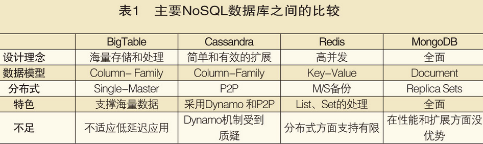

# 一, NoSQL之Redis

## 1. NOSQL简介

NoSQL泛指非关系型数据库. 

​	是以 key-value形式存储,  不支持SQL语句, 没有表结构, 和传统的关系型数据库不一样, 不一定遵循传统数据库的一些基本要求(非关系型的, 分布式的, 开源的. 水平可扩展的)

常见的NoSQL产品:



​	

**优点：**

​	**高并发读写**的性能

​	**大数据量的扩展**（分布式存储） 

​	配置简单 

​	灵活、高效的操作与数据模型 

​	低廉的成本 

**不足之处：** 

​	没有统一的标准 

​	没有正式的官方支持 

​	各种产品还不算成熟


##2. Redis简介 

Redis是以 key-value  store存储, data structure service 数据结构服务器. 键可以包含: (string) 字符串, 哈希, (list)链表, (set)无序集合, (zset) 有序集合. 这些数据集合都支持push/pop, add/remove及取交集和并集以及更丰富的操作, redis支持各种不同的方式排序, 为了保证效率, 数据都是存储在内存中, 它也可以周期性的把更新的数据写入磁盘或者把修改操作写入追加到文件记录中.

**优点**: 

- 对数据高并发读写


- 对海量数据的高效率存储和访问, 减轻数据库负担


- 对数据的可扩展性和高可用性


- 有集合计算功能(优于普通数据库和同类别产品)


​	支持多种数据结构

**缺点**:

- Redis对ACID(原子性, 隔离性, 一致性, 永久性)处理非常简单


- 无法做到太复杂的关系数据模型


**应用场景**

- 缓存（数据结构，短连接，新闻内容，商品内容等）。

- 分布式集群架构中的session分离。聊天室的在线好友列表。任务队列（秒杀，抢购，12306等等）。应用排行旁。（最多使用）
- 网站访问统计。数据过期处理（可以精确到毫秒）。

## 3. Redis 优势

-  性能极高 – Redis 读的速度是 110000 次 /s, 写的速度是 81000 次 /s 。 
- 丰富的数据类型；Redis支持二进制案例的Strings，Lists，Hashes，Sets和Ordered Sets数据类型操作
- 原子性；Redis的所有操作都是原子性的，意思是要么全部成功要么全部失败。单个操作是原子性的。多个操作也支持事务，即原子性，通过MULTI和EXEC指令包起来。
- 其它特性，Redis还支持publish/subscribe通知，key过期等特性。


# 二, 数据类型讲解

**redis一共分为五种基本数据类型: String, Hash, List, Set, ZSet**

 ## 1, String

string是redis最基本的类型

redis的string可以包含任何数据。包括jpg图片或者序列化的对象。

**单个value值最大上限是512MB**, 如果只用string类型，redis就可以被看作加上持久化特性（服务器重启之后，数据不丢失）的memcache.

**理解** 

**string 就像是 java 中的 map 一样，一个 key 对应一个 value**

 

首先我们从string谈起。string表示的是一个可变的字节数组，我们初始化字符串的内容、可以拿到字符串的长度，可以获取string的子串，可以覆盖string的子串内容，可以追加子串。 


**Redis的字符串是动态字符串，是可以修改的字符串，内部结构实现上类似于Java的ArrayList，采用预分配冗余空间的方式来减少内存的频繁分配**，如图中所示，内部为当前字符串实际分配的空间capacity一般要高于实际字符串长度len。当字符串长度小于1M时，扩容都是加倍现有的空间，如果超过1M，扩容时一次只会多扩1M的空间。需要注意的是字符串最大长度为512M。

  

**应用**

-  自增主键： 商品编号、订单号采用 string 的递增数字特性生成  


### 1.1, set和get方法

设置值:  set  name bhz 

取值 get name	(设置name多次会覆盖)

删除值: del name

```shell
127.0.0.1:6379> set test 123
OK

127.0.0.1:6379> get test
"123"

127.0.0.1:6379> del test
(integer) 1
```

### 1.2, setnx (not exist)

key如果不存在进行设置, 存在就不需要进行设置了, 返回0

```sh
127.0.0.1:6379> SETNX k1 asdasdas
(integer) 0
```

### 1.3, setex(expired 过期的字符串)

setex color 10 red 设置key为color的字符串有效期为10秒, 10秒后返回nil(在redis中nil表示为空)

### 1.4, setrange(替换字符串)

​	set email 1542123803@qq.com

​	setrange email 11 ww(11表示从第几位开始替换, 后面跟上替换的字符串)

### 1.5, incr和decr 

​	increment: incr key

​	decrement: decr key

​	对某一个值递增或者递减(值类型必须是数值型)；如果key不存在，相当于`set key [value]`

​	 **计数器是有范围的，它不能超过Long.Max，不能低于Long.MIN** 

### 1.6, incrby和decrby

​	对某个值(只支持数值类型)进行指定长度的递增或者递减；如果key不存在，相当于`set key [value]`

 	incrby key [步长]

​	decrby key [步长]

### 1.7 append [key]

​	字符串追加方法；如果key不存在，相当于`set key [value]`

​	append  key [value]

### 1.8, strlen [name]

​	获取字符串的长度

​	strlen key

### 1.9, mset和mget 

​	mset key1 val1 key2 val2 key3 val3; 对应的mget方法:

​	mget key1 key2 key3; 对应的也有msetnx

### 1.10, getset

 取值并赋值 getset key value 

```shell
127.0.0.1:6379> getset test 321
"123"
127.0.0.1:6379> get test
"321"
```

### 1.11, getrange和setrange

 **获取子串** 提供「变量名称」以及开始和结束位置[start, end] 

```shell
> getrange ireader 28 34
"youxian"
```

 **覆盖子串** 提供「变量名称」以及开始位置和目标子串 

```shell
> setrange ireader 28 wooxian
(integer) 42  # 返回长度
> get ireader
"beijing.zhangyue.keji.gufen.wooxian.gongsi"
```


## 2, hash散列类型

Hash类型是String类型的key和value的映射表, 或者说一个string集合. 它特别适合存储对象, 相比较而言, 将一个对象类型存储在Hash类型里要比存储在String类型里占用更少的内存空间, 并方便存取整个对象.

**理解：**

**可以将 hash 看成一个 key - value 的集合。也可以将其想成一个 hash 对应着多个 string。与 string 区别：string 是 一个 key - value 键值对，而 hash 是多个 key - value 键值对。**

  

**哈希等价于Java语言的HashMap或者是Python语言的dict，在实现结构上它使用二维结构，第一维是数组，第二维是链表，hash的内容key和value存放在链表中，数组里存放的是链表的头指针**。通过key查找元素时，先计算key的hashcode，然后用hashcode对数组的长度进行取模定位到链表的表头，再对链表进行遍历获取到相应的value值，链表的作用就是用来将产生了「hash碰撞」的元素串起来。Java语言开发者会感到非常熟悉，因为这样的结构和HashMap是没有区别的。哈希的第一维数组的长度也是2^n。

  

### 2.1, hset 和 hget  

​	语法: 

​	hset [key] field1 [value] (含义是hset是hash集合, [key]是集合名字, field1是字段名, [value1]为其值)

​	hget [key] field1 获取内容, 也存储多个值.

### 2.2, hmset 和 hmget

​	hmset可以进行批量存储多个键值对: **hmset** [key] set men addr changsha, 也可使用**hmget**进行批量获取多个键值对.

### 2.3, hsetnx 

​	和 **setnx** 大同小异

​	field如果不存在进行设置, 存在就不需要进行设置了, 返回0

### 2.4, hincrby 

​	增加数字

 	语法：hincrby key field increment 

```shell
127.0.0.1:6379> hincrby user age 2
(integer) 2
```

### 2.5, hexists

 	判断字段是否存在 ，不存在返回0

​	语法：hexists key field 

```shell
127.0.0.1:6379> hexists user age
(integer) 1
```

### 2.6, hlen

​	返回hash集合里的所有字段的数量

### 2.7, hdel

​	删除指定hash的field

### 2.8, hkeys

​	返回hash里所有的field名

### 2.9, hvals

​	返回hash里所有的value值

### 2.10, hgetall

​	返回hash里所有的key和value,类似于Java的Iterator

##3, list

list其实是一个双向链表的结合, 其主要功能有push, pop, 获取元素等	, 更详细的说, list类是一个双端链表的结构, 我们可以通过相关操作进行集合的头部或者尾部添加删除元素, list的设计非常简单精巧, 既可以作为栈, 又可以作为队列. 满足绝大数需求.

**理解**

Redis将列表数据结构命名为list而不是array，是因为**列表的存储结构用的是链表而不是数组**，而且链表还是双向链表。因为它是链表，所以随机定位性能较弱，首尾插入删除性能较优。如果list的列表长度很长，使用时我们一定要关注链表相关操作的时间复杂度。 

 

**在日常应用中，列表常用来作为异步队列来使用。 **

**快速列表**

 

如果再深入一点，你会发现Redis底层存储的还不是一个简单的linkedlist，而是称之为**快速链表quicklist的一个结构**。首先**在列表元素较少的情况下会使用一块连续的内存存储，这个结构是ziplist，也即是压缩列表。它将所有的元素紧挨着一起存储，分配的是一块连续的内存。当数据量比较多的时候才会改成quicklist。**因为普通的链表需要的附加指针空间太大，会比较浪费空间。比如这个列表里存的只是int类型的数据，结构上还需要两个额外的指针prev和next。所以Redis将链表和ziplist结合起来组成了quicklist。也就是**将多个ziplist使用双向指针串起来使用。**这样既满足了快速的插入删除性能，又不会出现太大的空间冗余。

**上进上出: 栈**

​	特点: 数据 先进后出


**下进上出: 队列**

​	特点: 数据 先进先出


### 3.1 lpush

​	从链表的头部加入元素(栈)	先进后出

​	形如: lpush list1 "hello"   lpush list2 "world"

### 3.2 rpush

​	从链表的尾部加入元素(队列)    先进先出

​	形如: rpush list3 "hello"   rpush list4 "world"

### 3.3 lrange

获取链表里的元素

​	语法: lrange  链表的名称  开始下标   结束下标

​	注意：如果开始下标是0结束下标是-1则是返回链表中所有的元素。

​	注意：链表里面的元素是序号的（从0开始数），类似于索引数组。


### 3.4 linsert

​	插入元素(以已存在的值为中心,在该值之前或者之后的位置插入值)

​	形如: linsert  list  before|after  已存在的值  新增的值 


### 3.5 lset

​	将指定下标的元素替换掉

​	语法: lset  key  下标  value

### 3.6 lrem

​	删除元素, 返回删除的个数

​	语法: `lrem  list  count  value`

​	count: 数量

​	value: 值

​	**注意：**

- 当`count > 0`时，LREM会从列表左边开始删除
- 当`count < 0`时，LREM会出列表右边开始删除
- 当`count = 0`是，LREM删除所有值为value的元素

### 3.7 ltrim

​	保留指定key的值范围内的数据

​	语法: ltrim  list  下标start 下标end


### 3.8 lpop

​	从list的头部删除元素, 并返回删除元素

​	语法: lpop  list


### 3.9 rpop

​	从list的尾部删除元素, 并返回删除元素

​	语法:  rpop list


### 3.10 rpoplpush

 	**将元素从一个列表转移到另一个列表** 

​	第一步从尾部删除元素, 然后第二步从头部加入元素

​	语法: rpoplpush  listKey  listKey


### 3.11 lindex

​	返回名称为key的list中index位置的元素

​	语法: lindex  list 下标


### 3.12 llen

​	返回list的长度

​	语法: llen  list


## 4, 无序集合-set

redis的 set 是 string 类型的无序集合. set是通过hashtable实现的, 对集合我们可以去取, 交集, 差集, 并集

set元素最大可以包含(2的32次方-1)(整数最大值)个元素

关于set集合类型除了基本的添加,删除操作, 其它有用的操作还包含集合的取并集(union), 交集(intersection),差集(difference). 通过这些操作可以很容易的实现sns中的好友推荐功能.

sina的好友关注关系就大量的使用了 set 集合类型.

  

**理解**

Java程序员都知道HashSet的内部实现使用的是HashMap，只不过所有的value都指向同一个对象。Redis的set结构也是一样，它的内部也使用hash结构，所有的value都指向同一个内部值。 

**注意:  每个集合中的各个元素不能重复**

该类型应用场合：qq好友推荐。

tom朋友圈(与某某是好友)：mary  jack  xiaoming  wang5  wang6

linken朋友圈(与某某是好友)：yuehan  daxiong  luce  wang5  wang6


### 4.1, sdd

​	向名称为 key 的set添加元素

​	语法: sadd  集合名（键名） 元素名称 ...


### 4.2, smembers

​	获取集合的元素

​	语法: members  集合名


### 4.3, srem

​	删除 set 元素

​	语法: srem  集合名  元素值 元素值 元素值...

### 4.4, spop

​	随机返回删除的key

​	语法: spop  集合名  count(元素个数)

### 4.5, sdiff

​	获取集合中的差集（在集合1中存在，不在集合2中存在的元素）

  

​	语法： sdiff key [key...] 

```sh
127.0.0.1:6379> sadd setA 1 2 3
(integer) 3
127.0.0.1:6379> sadd setB 2 3 4
(integer) 3
127.0.0.1:6379> sdiff setA setB
1) "1"
127.0.0.1:6379> sdiff setB setA
1) "4"
```

### 4.6, sdiffstore

​	将返回的不同元素存储到另一个集合里

​	语法: sdiffstore  存储的集合  集合1  集合2

### 4.7, sinter 

​	 集合的交集运算 属于A且属于B的元素构成的集合 

  

​	 语法：sinter key [key...] 

```shell
`127.0.0.1:6379> sinter setA setB1) "2"2) "3"`
```


### 4.8, sinterstore 

​	返回交集结果, 存储到另一个集合中

​	语法: sinterstore  集合3  集合1  集合2

### 4.9, sunion

​	 集合的并集运算 属于 A 或者 属于 B 的元素构成的集合 

  

​	 语法：sunion key [key...] 

```shell
127.0.0.1:6379> sunion setA setB
1) "1"
2) "2"
3) "3"
4) "4"
```

### 4.10, sunionstore

​	返回交集结果, 存储到另一个集合中

​	语法: sunionstore  集合3  集合1 集合2

###4.11, smove

​	从一个set集合移动到另一个set集合里面

​	将set1中的元素移动到set2中, 相当于剪切复制

​	语法: smove  set1  set2  set1所包含的元素

### 4.12, scard

​	查看set集合里元素个数

​	语法: scard  set集合

### 4.13, sismembers

​	判断某元素是否为集合中的元素

​	返回 '1' 代表是集合中的元素, 0代表不是

​	语法:  sismembers  set1  元素1

### 4.14, srandmember

​	随机返回一个或多个元素

​	语法: srandmember  set集合  [count]


## 5, 有序集合-zset

sorted set是set的一个升级版本, 他在set的基础上增加了一个顺序属性, 这一属性在添加修改元素的时候可以指定, 每次指定后, zset会自动重新按新的值调整顺序. 

    

**理解**

SortedSet(Zset)是Redis提供的一个非常特别的数据结构，一方面它等价于Java的数据结构`Map<String, Double>`，可以给每一个元素value赋予一个权重`score`，另一方面它又类似于`TreeSet`，内部的元素会按照权重score进行排序，可以得到每个元素的排序，可以得到每个元素的名次，还可以通过score的范围来获取元素的列表。

**zset底层实现使用了两个数据结构，第一个是hash，第二个是跳跃列表**，`hash`的作用是关联元素`value`和权重`score`，保证value的唯一性，可以通过元素`value`找到相应的`score`值。**跳跃列表的目的在于给元素value排序，根据score的范围获取元素列表。**

### 5.1, zadd

​	向有序集合中添加元素. 如果该元素存在, 则更新顺序

​	语法: zadd  集合名  序号 内容...(zadd  zset1 1  one  2  two  3  three  ...)

### 5.2, zrem

​	删除名称为key的zset中的元素member

​	语法: zrem  zset1  元素

### 5.3, zincrby

​	增加某个元素的分数

​	返回值是更改后的分数 

​	语法：zincrby key increment member 

```shell
127.0.0.1:6379> ZINCRBY scoreboard 4 lisi
"101“
```

###5.4, zrangebyscore  

​	获得指定分数范围的元素

​	 语法：`zrangebyscore key min max [withscores][limit offset count]` 

```shell
`127.0.0.1:6379> ZRANGEBYSCORE scoreboard 90 97 WITHSCORES1) "wangwu"2) "94"3) "lisi"4) "97"127.0.0.1:6379> ZRANGEBYSCORE scoreboard 70 100 limit 1 21) "wangwu"2) "lisi"`
```

### 5.5, zremrangebyrank

​	按照排名范围删除元素

​	语法: zremrangebyrank  zset集合  startIndex  endIndex

```shell
127.0.0.1:6379> zremrangebyrank scoreboard 0 1
(integer) 2
127.0.0.1:6379> zrange scoreboard 0 -1
1) "wangwu"
```

### 5.6, zremrangebyscore

​	按照分数范围删除元素

​	语法: zremrangebyscore  zset集合  minScore  maxScore

```sh
`127.0.0.1:6379> zadd scoreboard 84 zhangsan(integer) 1127.0.0.1:6379> ZREMRANGEBYSCORE scoreboard 80 100(integer) 1`
```

### 5.7, zrange 

​	按照元素分数从小到大的顺序返回索引从start到stop之间的所有元素（包含两端的元素） , 默认是升续排列 , 	  withscores 是把score也打印出来

​	语法: zrange 集合名称 开始下标  结束下标  [withscores]

```shell
`127.0.0.1:6379> zrange scoreboard 0 21) "zhangsan"2) "wangwu"`
```

### 5.8, zrevrange

​	按序号降序获取有序集合中的内容

​	语法:  语法：zrevrange key start stop [withscores] 

```shell
`127.0.0.1:6379> zrevrange scoreboard 0 21) "wangwu"2) "zhangsan"`
```

### 5.9, zrank

​	返回排序索引, 从小到大排序(**升序排序之后再找索引**)

​	注意, 一个是顺序排序, 一个是索引排序, zrank返回的是索引

​	语法: zrank  zset集合名称  元素

###5.10, zrevrank 

​	返回排序索引, 从大到小排序(降序排序之后在找索引)

​	语法: zrevrank  zset集合名称  元素值

### 5.11, zcard

​	返回集合里所有元素的个数

​	语法: zcard  zset集合

### 5.12, zcount

​	返回集合中score在给定区间中的数量

​	语法:  zcount  zset集合  minScore  MaxScore

### 5.13,  zscore

获取元素分数

 语法：zscore key member 

```shell
127.0.0.1:6379> zscore scoreboard lisi
"97"
```


# 三, Redis常用命令

redis提供了丰富的命令对数据库和各种数据库类型进行操作，这些命令可以在linux终端使用。 

1、键值相关的命令 

2、服务器相关命令

## 1, keys

​	返回当前数据库里面的键，可以使用通配符，* 表示：任意多个，？任意一个字符。


 ## 2, exists

​	判断一个键是否存在

​	语法: exists  键名称

##3, del

​	删除指定的键

​	语法： del  键名称

## 4, expire

​	设置键的有效期

​	语法: expire  key  有效期(单位: 秒)

### 4.1 persist

​	取消过期时间

 	语法: persist  key

##5, ttl

​	查看一个键剩余的过期时间
​	语法: ttl  key

##6, type

​	返回数据类型

​	语法： type  key

##7, select

​	选择数据库, 在redis里默认有0-15个数据库, 默认是0号数据库, 可以通过redis.conf配置文件进行配置.

​	**数据库划分是属于逻辑划分的, 非物理划分**.

​	切换数据库语法: select  数据库的编号

## 8, move

​	将当前数据库中的key转移到其他数据库中

​	语法: move  key  db

##9, dbsize

​	返回当前数据库里面键的个数

​	语法: dbsize

## 10, randomkey

​	随机返回数据库里的一个key

​	语法: randomkey

## 11, rename

​	重命名key

​	语法: rename  key  newName

## 12, echo

​	打印命令

## 13, info

​	获取数据库信息

## 14, config get

​	返回相关的配置信息

​	语法: config  get  *

##15, flushdb

​	清空当前数据库里面所有的键

​	语法: flushdb

## 16, flushall

​	清空所有数据库里面的所有的键，（慎重使用）

​	语法: flushall

## 17, redis, sentinel关闭服务

​	pkill redis-server

​	pkill redis-sentinel

## 18, redis开启服务

​	/usr/local/redis/bin/redis-server  /usr/local/redis/etc/redis.conf

## 19, sentinel开启服务

​	/usr/local/redis/bin/redis-sentinel  /usr/local/redis/etc/sentinel.conf


# 四, 主从复制

## 主从复制:

​	**主服务器用来写入数据, 从服务器用来读取数据**

​	1, Master可以拥有多个slave;

​	2, 多个slave可以连接同一个master外, 还可以连接其它的slave;

​	3, 主从复制不会阻塞master, 在同步数据时, master可以继续处理client(用户)请求;

​	4, 提供系统的伸缩性;

## 主从复制过程:

​	1, slave与master建立连接, 发送sync同步命令

​	2, master会开启一个后台进程, 将数据库快照保存到文件中, 同时master主进程会开始收集新的写命令并缓存

​	3, 后台完成保存后, 就将文件发送给slave

​	4, slave将此文件保存到硬盘中

## 主从复制配置:

​	clone服务器之后修改slave的IP地址

​	修改配置文件: /usr/local/redis/etc/redis.conf

​	第一步: slaveof<masterip><mastport>

​	第二步: masterauth<master-password>

使用info查看role角色即可知道是主服务还是从服务

## 配置Redis.conf主从

### 1, 修改master的redis.conf

```xml
# Redis默认不是以守护进程的方式运行，可以通过该配置项修改，使用yes启用守护进程
daemonize yes

# 当Redis以守护进程方式运行时，Redis默认会把pid写入/var/run/redis.pid文件，可以通过pidfile指定
pidfile "/var/run/redis.pid"

# 端口
port 6379

tcp-backlog 511

# 当客户端闲置多长时间后关闭连接，如果指定为0，表示关闭该功能
timeout 0

tcp-keepalive 0

# 指定日志记录级别，Redis总共支持四个级别：debug、verbose、notice、warning，默认为verbose
loglevel notice

# 日志记录方式，默认为标准输出，如果配置Redis为守护进程方式运行，而这里又配置为日志记录方式为标准输出，则 # 日志将会发送给/dev/null
logfile "/usr/local/redis/redis.log"

# 设置数据库的数量，默认数据库为0，可以使用SELECT <dbid>命令在连接上指定数据库id
databases 16

# 指定在多长时间内，有多少次更新操作，就将数据同步到数据文件，可以多个条件配合
# 分别表示900秒（15分钟）内有1个更改，300秒（5分钟）内有10个更改以及60秒内有10000个更改。
save 900 1

save 300 10

save 60 10000

stop-writes-on-bgsave-error yes

# 指定存储至本地数据库时是否压缩数据，默认为yes，Redis采用LZF压缩，如果为了节省CPU时间，可以关闭该选项， # 但会导致数据库文件变的巨大
rdbcompression yes

rdbchecksum yes

# 指定本地数据库文件名，默认值为dump.rdb
dbfilename "dump.rdb"

# 指定本地数据库存放目录
dir "/usr/local/redis"

slave-serve-stale-data yes

slave-read-only yes

repl-diskless-sync no

repl-diskless-sync-delay 5

repl-disable-tcp-nodelay no

slave-priority 100

# 设置Redis连接密码，如果配置了连接密码，客户端在连接Redis时需要通过AUTH <password>命令提供密码，默认关 # 闭
requirepass "123456"

# 指定是否在每次更新操作后进行日志记录，Redis在默认情况下是异步的把数据写入磁盘，如果不开启，可能会在断电# 时导致一段时间内的数据丢失。因为 redis本身同步数据文件是按上面save条件来同步的，所以有的数据会在一段时# 间内只存在于内存中。默认为no
appendonly yes

# 指定更新日志文件名，默认为appendonly.aof
appendfilename "appendonly.aof"

# 指定更新日志条件，共有3个可选值： 
# no：表示等操作系统进行数据缓存同步到磁盘（快） 
# always：表示每次更新操作后手动调用fsync()将数据写到磁盘（慢，安全） 
# everysec：表示每秒同步一次（折衷，默认值）
appendfsync everysec

no-appendfsync-on-rewrite no

auto-aof-rewrite-percentage 100

auto-aof-rewrite-min-size 64mb

aof-load-truncated yes

lua-time-limit 5000

slowlog-log-slower-than 10000

slowlog-max-len 128

latency-monitor-threshold 0

notify-keyspace-events ""

hash-max-ziplist-entries 512

hash-max-ziplist-value 64

list-max-ziplist-entries 512

list-max-ziplist-value 64

set-max-intset-entries 512

zset-max-ziplist-entries 128

zset-max-ziplist-value 64

hll-sparse-max-bytes 3000

# 指定是否激活重置哈希，默认为开启
activerehashing yes

client-output-buffer-limit normal 0 0 0

client-output-buffer-limit slave 256mb 64mb 60

client-output-buffer-limit pubsub 32mb 8mb 60

hz 10

aof-rewrite-incremental-fsync yes

# 当master服务设置了密码保护时，slav服务连接master的密码
masterauth "123456"

protected-mode yes
```

### 2, 修改slave的redis.conf

```xml
# Redis默认不是以守护进程的方式运行，可以通过该配置项修改，使用yes启用守护进程
daemonize yes

# 当Redis以守护进程方式运行时，Redis默认会把pid写入/var/run/redis.pid文件，可以通过pidfile指定
pidfile "/var/run/redis.pid"

# 端口
port 6379

tcp-backlog 511

# 当客户端闲置多长时间后关闭连接，如果指定为0，表示关闭该功能
timeout 0

tcp-keepalive 0

# 指定日志记录级别，Redis总共支持四个级别：debug、verbose、notice、warning，默认为verbose
loglevel notice

# 日志记录方式，默认为标准输出，如果配置Redis为守护进程方式运行，而这里又配置为日志记录方式为标准输出，则 # 日志将会发送给/dev/null
logfile "/usr/local/redis/redis.log"

# 设置数据库的数量，默认数据库为0，可以使用SELECT <dbid>命令在连接上指定数据库id
databases 16

# 指定在多长时间内，有多少次更新操作，就将数据同步到数据文件，可以多个条件配合
# 分别表示900秒（15分钟）内有1个更改，300秒（5分钟）内有10个更改以及60秒内有10000个更改。
save 900 1

save 300 10

save 60 10000

stop-writes-on-bgsave-error yes

# 指定存储至本地数据库时是否压缩数据，默认为yes，Redis采用LZF压缩，如果为了节省CPU时间，可以关闭该选项， # 但会导致数据库文件变的巨大
rdbcompression yes

rdbchecksum yes

# 指定本地数据库文件名，默认值为dump.rdb
dbfilename "dump.rdb"

# 指定本地数据库存放目录
dir "/usr/local/redis"

slave-serve-stale-data yes

slave-read-only yes

repl-diskless-sync no

repl-diskless-sync-delay 5

repl-disable-tcp-nodelay no

slave-priority 100

# 设置Redis连接密码，如果配置了连接密码，客户端在连接Redis时需要通过AUTH <password>命令提供密码，默认关 # 闭
requirepass "123456"

# 指定是否在每次更新操作后进行日志记录，Redis在默认情况下是异步的把数据写入磁盘，如果不开启，可能会在断电# 时导致一段时间内的数据丢失。因为 redis本身同步数据文件是按上面save条件来同步的，所以有的数据会在一段时# 间内只存在于内存中。默认为no
appendonly yes

# 指定更新日志文件名，默认为appendonly.aof
appendfilename "appendonly.aof"

# 指定更新日志条件，共有3个可选值： 
# no：表示等操作系统进行数据缓存同步到磁盘（快） 
# always：表示每次更新操作后手动调用fsync()将数据写到磁盘（慢，安全） 
# everysec：表示每秒同步一次（折衷，默认值）
appendfsync everysec

no-appendfsync-on-rewrite no

auto-aof-rewrite-percentage 100

auto-aof-rewrite-min-size 64mb

aof-load-truncated yes

lua-time-limit 5000

slowlog-log-slower-than 10000

slowlog-max-len 128

latency-monitor-threshold 0

notify-keyspace-events ""

hash-max-ziplist-entries 512

hash-max-ziplist-value 64

list-max-ziplist-entries 512

list-max-ziplist-value 64

set-max-intset-entries 512

zset-max-ziplist-entries 128

zset-max-ziplist-value 64

hll-sparse-max-bytes 3000

# 指定是否激活重置哈希，默认为开启
activerehashing yes

client-output-buffer-limit normal 0 0 0

client-output-buffer-limit slave 256mb 64mb 60

client-output-buffer-limit pubsub 32mb 8mb 60

hz 10

aof-rewrite-incremental-fsync yes

# 当master服务设置了密码保护时，slav服务连接master的密码
masterauth "123456"

protected-mode yes

# 设置当本机为slav服务时，设置master服务的IP地址及端口，在Redis启动时，它会自动从master进行数据同步
slaveof 10.6.11.164 6379
```


#五, Sentinel 哨兵

​	Sentinel哨兵是redis官方提供的高可用方案, **可以用它来监控多个Redis服务实例的运行情况. Redis Sentinel是一个运行再特殊模式下的Redis服务器. Redis Sentinel 是在多个Sentinel进程环境下互相协作工作的.**

​	**Sentinel(哨兵)进程是用于监控redis集群中Master主服务器工作的状态，在Master主服务器发生故障的时候，可以实现Master和Slave服务器的切换，保证系统的高可用**，其已经被集成在redis2.6+的版本中，Redis的哨兵模式到了2.8版本之后就稳定了下来。一般在生产环境也建议使用Redis的2.8版本的以后版本。**哨兵(Sentinel) 是一个分布式系统，你可以在一个架构中运行多个哨兵(sentinel) 进程，这些进程使用流言协议(gossipprotocols)来接收关于Master主服务器是否下线的信息，并使用投票协议(Agreement Protocols)来决定是否执行自动故障迁移,以及选择哪个Slave作为新的Master**。**每个哨兵(Sentinel)进程会向其它哨兵(Sentinel)、Master、Slave定时发送消息，以确认对方是否”活”着，如果发现对方在指定配置时间(可配置的)内未得到回应，则暂时认为对方已掉线，也就是所谓的”主观认为宕机”** ，英文名称：Subjective Down，简称SDOWN。有主观宕机，肯定就有客观宕机。**当“哨兵群”中的多数Sentinel进程在对Master主服务器做出 SDOWN 的判断，并且通过 SENTINEL is-master-down-by-addr 命令互相交流之后，得出的Master Server下线判断，这种方式就是“客观宕机”**，英文名称是：Objectively Down， 简称 ODOWN。**通过一定的vote算法，从剩下的slave从服务器节点中，选一台提升为Master服务器节点，然后自动修改相关配置，并开启故障转移（failover）。** 

​	哨兵(sentinel) 虽然有一个单独的可执行文件 redis-sentinel ,但实际上它只是一个运行在特殊模式下的 Redis 服务器，你可以在启动一个普通 Redis 服务器时通过给定 --sentinel 选项来启动哨兵(sentinel)，哨兵(sentinel) 的一些设计思路和zookeeper非常类似。 

​	Sentinel集群之间会互相通信，沟通交流redis节点的状态，做出相应的判断并进行处理，这里的主观下线状态和客观下线状态是比较重要的状态，它们决定了是否进行故障转移，可以 通过订阅指定的频道信息，当服务器出现故障得时候通知管理员，客户端可以将 Sentinel 看作是一个只提供了订阅功能的 Redis 服务器，你不可以使用 PUBLISH 命令向这个服务器发送信息，但你可以用 SUBSCRIBE 命令或者 PSUBSCRIBE 命令， 通过订阅给定的频道来获取相应的事件提醒。一个频道能够接收和这个频道的名字相同的事件。 比如说， 名为 +sdown 的频道就可以接收所有实例进入主观下线（SDOWN）状态的事件。 

​	

##1,Sentinel（哨兵）进程的作用

监控(Monitoring) : 

​	Sentinel 不断的检查主服务器和从服务器是否正常运行。 

提醒(Notification) : 

​	被监控的Redis出现问题时, 哨兵(sentinel) 可以通过 API 向管理员或者其他应用程序发送通知。 

自动故障转移(Automatic failover) :

​	当一个Master不能正常工作时，哨兵(sentinel) 会开始一次自动故障迁移操作，它会将失效Master的其					  中一个Slave升级为新的Master, 并让失效Master的其他Slave改为复制新的Master；当客户端试图连接失效的Master时，集群也会向客户端返回新Master的地址，使得集群可以使用现在的Master替换失效Master。Master和Slave服务器切换后，Master的redis.conf、Slave的redis.conf和sentinel.conf的配置文件的内容都会发生相应的改变，即，Master主服务器的redis.conf配置文件中会多一行slaveof的配置，sentinel.conf的监控目标会随之调换。

哨兵一定得是奇数个; 哨兵会以心跳的形式请求每个Redis, 当一个哨兵无法访问master后, 确认该redis无法正常工作, 会投赞成票, 赞成票大于反对票后, 会进行 "自动故障转移" 任务(少数服从多数);


## 2, **Sentinel进程的工作方式** 

1】、每个Sentinel（哨兵）进程以每秒钟一次的频率向整个集群中的Master主服务器，Slave从服务器以及其他Sentinel（哨兵）进程发送一个 PING 命令。

2】、如果一个实例（instance）距离最后一次有效回复 PING 命令的时间超过 down-after-milliseconds 选项所指定的值， 则这个实例会被 Sentinel（哨兵）进程标记为主观下线（SDOWN）。 

3】、如果一个Master主服务器被标记为主观下线（SDOWN），则正在监视这个Master主服务器的所有 Sentinel（哨兵）进程要以每秒一次的频率确认Master主服务器的确进入了主观下线状态。

4】、当有足够数量的 Sentinel（哨兵）进程（大于等于配置文件指定的值）在指定的时间范围内确认Master主服务器进入了主观下线状态（SDOWN）， 则Master主服务器会被标记为客观下线（ODOWN）。               

5】、在一般情况下， 每个 Sentinel（哨兵）进程会以每 10 秒一次的频率向集群中的所有Master主服务器、Slave从服务器发送 INFO 命令。               

6】、当Master主服务器被 Sentinel（哨兵）进程标记为客观下线（ODOWN）时，Sentinel（哨兵）进程向下线的 Master主服务器的所有 Slave从服务器发送 INFO 命令的频率会从 10 秒一次改为每秒一次。               

7】、若没有足够数量的 Sentinel（哨兵）进程同意 Master主服务器下线， Master主服务器的客观下线状态就会被移除。若 Master主服务器重新向 Sentinel（哨兵）进程发送 PING 命令返回有效回复，Master主服务器的主观下线状态就会被移除。 


## 3, Sentinel配置

### 1, master的Sentinel配置文件

```xml
protected-mode no

sentinel deny-scripts-reconfig yes

# 告诉sentinel去监听地址为ip:port的一个master，这里的master-name可以自定义，quorum是一个数字，指明当 # 有多少个sentinel认为一个master失效时，master才算真正失效。master-name只能包含英文字母，数字，和“.-#  # _”这三个字符需要注意的是master-ip 要写真实的ip地址而不要用回环地址（127.0.0.1）。
sentinel monitor mymaster 10.6.11.164 6379 2

# 这个配置项指定了需要多少失效时间，一个master才会被这个sentinel主观地认为是不可用的。 单位是毫秒，默认# 为30秒
sentinel down-after-milliseconds mymaster 5000

# 1. 同一个sentinel对同一个master两次failover之间的间隔时间。
# 2. 当一个slave从一个错误的master那里同步数据开始计算时间。直到slave被纠正为向正确的master那里同步数据# 时。
# 3.当想要取消一个正在进行的failover所需要的时间。  
# 4.当进行failover时，配置所有slaves指向新的master所需的最大时间。不过，即使过了这个超时，slaves依然会# 被正确配置为指向master，但是就不按parallel-syncs所配置的规则来了。
sentinel failover-timeout mymaster 15000

# 设置连接master和slave时的密码，注意的是sentinel不能分别为master和slave设置不同的密码，因此master和  # slave的密码应该设置相同。
sentinel auth-pass mymaster 123456

# Generated by CONFIG REWRITE

# 端口
port 26379

# 指定本地数据库存放目录
dir "/usr/local/redis"

sentinel config-epoch mymaster 1

sentinel leader-epoch mymaster 1

# slave从服务器IP地址
sentinel known-slave mymaster 10.6.11.189 6379

sentinel known-slave mymaster 10.6.11.201 6379

sentinel current-epoch 1

sentinel announce-ip "10.6.11.164"
```

### 2, slave的Sentine配置文件

```xml
protected-mode no

sentinel myid 3750d9547cf4e99c142984032492d43908ed8790

sentinel deny-scripts-reconfig yes

# 告诉sentinel去监听地址为ip:port的一个master，这里的master-name可以自定义，quorum是一个数字，指明当 # 有多少个sentinel认为一个master失效时，master才算真正失效。master-name只能包含英文字母，数字，和“.-#  # _”这三个字符需要注意的是master-ip 要写真实的ip地址而不要用回环地址（127.0.0.1）。
sentinel monitor mymaster 10.6.11.164 6379 2

# 这个配置项指定了需要多少失效时间，一个master才会被这个sentinel主观地认为是不可用的。 单位是毫秒，默认# 为30秒
sentinel down-after-milliseconds mymaster 5000

# 1. 同一个sentinel对同一个master两次failover之间的间隔时间。
# 2. 当一个slave从一个错误的master那里同步数据开始计算时间。直到slave被纠正为向正确的master那里同步数据# 时。
# 3.当想要取消一个正在进行的failover所需要的时间。  
# 4.当进行failover时，配置所有slaves指向新的master所需的最大时间。不过，即使过了这个超时，slaves依然会# 被正确配置为指向master，但是就不按parallel-syncs所配置的规则来了。
sentinel failover-timeout mymaster 15000

# 设置连接master和slave时的密码，注意的是sentinel不能分别为master和slave设置不同的密码，因此master和  # slave的密码应该设置相同。
sentinel auth-pass mymaster 123456

# Generated by CONFIG REWRITE

# 端口
port 26379

# 指定本地数据库存放目录
dir "/usr/local/redis"

sentinel config-epoch mymaster 1

sentinel leader-epoch mymaster 1

# slave从服务器IP地址
sentinel known-slave mymaster 10.6.11.189 6379

sentinel known-slave mymaster 10.6.11.201 6379

sentinel current-epoch 1

sentinel announce-ip "10.6.11.164"
```


## 4, 主观下线和客观下线

**主观下线（Subjectively Down， 简称 SDOWN）指的是单个 Sentinel 实例对服务器做出的下线判断。** 

**客观下线（Objectively Down， 简称 ODOWN）指的是多个 Sentinel 实例在对同一个服务器做出 SDOWN 判断，并且通过 SENTINEL is-master-down-by-addr 命令互相交流之后，得出的服务器下线判断。（一个 Sentinel 可以通过向另一个 Sentinel 发送 SENTINEL is-master-down-by-addr 命令来询问对方是否认为给定的服务器已下线。）** 


如果一个服务器没有在 master-down-after-milliseconds 选项所指定的时间内，对向它发送 PING 命令的 Sentinel（哨兵）进程返回一个有效回复（valid reply），那么  Sentinel（哨兵）进程就会将这个服务器标记为主观下线。服务器对 PING 命令的有效回复可以是以下三种回复的其中一种：  

​	1、返回 +PONG 。                 

​	2、返回 -LOADING 错误。                

​	3、返回 -MASTERDOWN 错误。 

如果服务器返回除以上三种回复之外的其他回复，又或者在指定时间内没有回复 PING 命令，那么 Sentinel（哨兵）进程认为服务器返回的回复无效（non-valid）。 如果一个服务器在 master-down-after-milliseconds 毫秒内，一直返回无效回复才会被 Sentinel 标记为主观下线。举个例子，如果 master-down-after-milliseconds 选项的值为 30000 毫秒（30 秒），那么只要服务器能在每 29 秒之内返回至少一次有效回复， 这个服务器就仍然会被认为是处于正常状态的。 

​	**从“主观下线”状态切换到“客观下线”状态并没有使用严格的法定人数算法（strong quorum algorithm），而是使用了流言协议，该协议解释为：如果 Sentinel（哨兵）进程在给定的时间范围内，从其他 Sentinel（哨兵）进程那里接收到了足够数量的主服务器下线报告， 那么 Sentinel（哨兵）进程就会将主服务器的状态从“主观下线”改变为“客观下线”。如果之后其他 Sentinel（哨兵）进程不再报告主服务器已下线，那么“客观下线”状态就会被移除。** 

​	**“客观下线”条件只适用于主服务器：对于任何其他类型的 Redis 实例，  Sentinel（哨兵）进程在将它们判断为下线前不需要进行协商，所以Slave从服务器或者其他 Sentinel（哨兵）进程永远不会达到“客观下线”条件。** 

​	**只要有一个 Sentinel（哨兵）进程发现某个主服务器进入了“客观下线”状态，这个 Sentinel（哨兵）进程就可能会被其他 Sentinel（哨兵）进程推选出，并对失效的主服务器执行自动故障迁移操作。** 


## 5, 哨兵模式的优缺点

​	**优点：** 

​		1、哨兵集群模式是基于主从模式的，所有主从的优点，哨兵模式同样具有。 

​		2、主从可以切换，故障可以转移，系统可用性更好。 

​		3、哨兵模式是主从模式的升级，系统更健壮，可用性更高。  

​	**缺点:**

​		1、Redis较难支持在线扩容，在集群容量达到上限时在线扩容会变得很复杂。为避免这一问题，运维人

​		员在系统上线时必须确保有足够的空间，这对资源造成了很大的浪费。 


# 六, 发布与订阅消息

reids提供了简单的发布与订阅功能

使用 subscribe [频道] 进行订阅监听

使用 publish [频道]  发布的内容 进行发布广播消息


# 七, Redis的事务

​	Redis会将一个事务中的所有命令序列化，然后按顺序执行。**Redis不可能在一个Redis事务的执行过程中插入执行另一个客户端发出的请求。这样便能保证Redis将这些命令作为一个单独的隔离操作执行。** > 在一个Redis事务中，Redis要么执行其中的所有命令，要么什么都不执行。因此，Redis事务能够保证原子性。EXEC命令会触发执行事务中的所有命令。因此，当某个客户端正在执行一次事务时，如果它在调用MULTI命令之前就从Redis服务端断开连接，那么就不会执行事务中的任何操作；相反，如果它在调用EXEC命令之后才从Redis服务端断开连接，那么就会执行事务中的所有操作。当Redis使用只增文件（AOF：Append-only File）时，Redis能够确保使用一个单独的write(2)系统调用，这样便能将事务写入磁盘。然而，如果Redis服务器宕机，或者系统管理员以某种方式停止Redis服务进程的运行，那么Redis很有可能只执行了事务中的一部分操作。Redis将会在重新启动时检查上述状态，然后退出运行，并且输出报错信息。使用redis-check-aof工具可以修复上述的只增文件，这个工具将会从上述文件中删除执行不完全的事务，这样Redis服务器才能再次启动。

## 1, 相关命令

### 1.1, multi

​	用于标记事务块的开始。Redis会将后续的命令逐个放入队列中，然后才能使用EXEC命令原子化地执行这个命令序列。

​	这个命令的运行格式如下所示：

​	MULTI

​	这个命令的返回值是一个简单的字符串，总是OK。 

### 1.2, exec

​	在一个事务中执行所有先前放入队列的命令，然后恢复正常的连接状态。

​	当使用WATCH命令时，只有当受监控的键没有被修改时，EXEC命令才会执行事务中的命令，这种方式利用了检查再设置（CAS）的机制。

​	这个命令的运行格式如下所示：

​	EXEC

​	这个命令的返回值是一个数组，其中的每个元素分别是原子化事务中的每个命令的返回值。 当使用WATCH命令时，如果事务执行中止，那么EXEC命令就会返回一个Null值。

### 1.3, discard

​	清除所有先前在一个事务中放入队列的命令，然后恢复正常的连接状态。

​	如果使用了WATCH命令，那么DISCARD命令就会将当前连接监控的所有键取消监控。

​	这个命令的运行格式如下所示：

​	discard

​	这个命令的返回值是一个简单的字符串，总是OK。

### 1.4, watch

​	当某个事务需要按条件执行时，就要使用这个命令将给定的键设置为受监控的。watch可以用来实现乐观锁

​	这个命令的运行格式如下所示：

​	watch  key  [key...]

​	这个命令的返回值是一个简单的字符串，总是OK。

​	对于每个键来说，时间复杂度总是O(1)。

###1.5, unwatch

​	清除所有先前为一个事务监控的键。

​	如果你调用了EXEC或DISCARD命令，那么就不需要手动调用UNWATCH命令。

​	这个命令的运行格式如下所示：

​	unwatch

​	这个命令的返回值是一个简单的字符串，总是OK。

​	时间复杂度总是O(1)。

## 2, 使用方法

​	使用MULTI命令便可以进入一个Redis事务。这个命令的返回值总是OK。此时，用户可以发出多个Redis命令。Redis会将这些命令放入队列，而不是执行这些命令。一旦调用EXEC命令，那么Redis就会执行事务中的所有命令。

​	相反，调用DISCARD命令将会清除事务队列，然后退出事务。

​	当一个Redis连接正处于MULTI请求的上下文中时，通过这个连接发出的所有命令的返回值都是QUEUE字符串（从Redis协议的角度来看，返回值是作为状态回复（Status Reply）来发送的）。当调用EXEC命令时，Redis会简单地调度执行事务队列中的命令。


​	由于get a 和set a并不能保证两个命令是连续执行的(get操作不在事务上下文中)。很可能有两个client同时做这个操作。主要问题我们没有对共享资源a的访问进行任何的同步,也就是说redis没提供任何的加锁机制来同步对a的访问。而watch命令可以用来实现乐观锁。看这个正确实现incr命令的例子,只是在前面加了watch a


​	watch 命令会监视给定的key,当exec时候如果监视的key从调用watch后发生过变化，则整个事务会失败。也可以调用watch多次监视多个key.这 样就可以对指定的key加乐观锁了。注意watch的key是对整个连接有效的，事务也一样。如果连接断开，监视和事务都会被自动清除。当然了 exec,discard,unwatch命令都会清除连接中的所有监视.

## 3, 为什么Redis不支持回滚？

​	如果你具备关系型数据库的知识背景，你就会发现一个事实：在事务运行期间，**虽然Redis命令可能会执行失败，但是Redis仍然会执行事务中余下的其他命令，而不会执行回滚操作**，你可能会觉得这种行为很奇怪。

​	然而，这种行为也有其合理之处：

> ​	只有当被调用的Redis命令有语法错误时，这条命令才会执行失败（在将这个命令放入事务队列期间，Redis能够发现此类问题），或者对某个键执行不符合其数据类型的操作：实际上，这就意味着只有程序错误才会导致Redis命令执行失败，这种错误很有可能在程序开发期间发现，一般很少在生产环境发现。 
> Redis已经在系统内部进行功能简化，这样可以确保更快的运行速度，因为Redis不需要事务回滚的能力。

​	对于Redis事务的这种行为，有一个普遍的反对观点，那就是程序有可能会有缺陷（bug）。但是，你应当注意到：事务回滚并不能解决任何程序错误。例如，如果某个查询会将一个键的值递增2，而不是1，或者递增错误的键，那么事务回滚机制是没有办法解决这些程序问题的。请注意，没有人能解决程序员自己的错误，这种错误可能会导致Redis命令执行失败。正因为这些程序错误不大可能会进入生产环境，所以我们在开发Redis时选用更加简单和快速的方法，没有实现错误回滚的功能。

## 4, 通过CAS操作实现乐观锁

Redis使用WATCH命令实现事务的“检查再设置”（CAS）行为。

​	**作为WATCH命令的参数的键会受到Redis的监控，Redis能够检测到它们的变化。在执行EXEC命令之前，如果Redis检测到至少有一个键被修改了，那么整个事务便会中止运行，然后EXEC命令会返回一个Null值，提醒用户事务运行失败。**

例如，设想我们需要将某个键的值自动递增1（假设Redis没有INCR命令）。

首次尝试的伪码可能如下所示：

```
val = GET mykey
val = val + 1
SET mykey $val
```

​	如果我们只有一个Redis客户端在一段指定的时间之内执行上述伪码的操作，那么这段伪码将能够可靠的工作。如果有多个客户端大约在同一时间尝试递增这个键的值，那么将会产生竞争状态。例如，客户端-A和客户端-B都会读取这个键的旧值（例如：10）。这两个客户端都会将这个键的值递增至11，最后使用SET命令将这个键的新值设置为11。因此，这个键的最终值是11，而不是12。

现在，我们可以使用WATCH命令完美地解决上述的问题，伪码如下所示：

```
WATCH mykey
val = GET mykey
val = val + 1
MULTI
SET mykey $val
EXEC
```

​	由上述伪码可知，如果存在竞争状态，并且有另一个客户端在我们调用WATCH命令和EXEC命令之间的时间内修改了val变量的结果，那么事务将会运行失败。

​	我们只需要重复执行上述伪码的操作，希望此次运行不会再出现竞争状态。这种形式的锁就被称为乐观锁，它是一种非常强大的锁。在许多用例中，多个客户端可能会访问不同的键，因此不太可能发生冲突 —— 也就是说，通常没有必要重复执行上述伪码的操作。


# 八, 持久化特性

**redis是一个支持持久化的内存数据库, 也就是说redis需要经常将内存中的数据同步到硬盘来保存持久化.**	

redis持久化的两种方式:

## 1, snapshotting(快照):

​	快照是redis的默认方式, 将内存中以快照的方式写入到二进制文件中, 默认为dump.rdb可以通过配置设置自动做快照持久化的方式. 保存数据是在单独的进程中写文件, 不影响redis的正常使用. RDB恢复数据时比其他AOF速度快.

snapshotting设置:

```xml
redis.conf:

save 900 1	# 900秒内如果超过1个key被修改, 则发起快照保存
save 300 10	# 300秒内如果超过10个key被修改, 则发起快照保存
save 60 10000
```

①:	dbfilename: 设置RDB的文件名, 默认文件名为 dump.rdb

②:	dir: 指定RDB文件的存储位置, 默认是 ./ 当前目录

## 2, append-only file(aof)

​	aof有点类似于oracle日志, 由于快照方式是在一定时间间隔做一次, 所以可能发生redis意外, down的情况就会丢失最后一次快照后所修改的数据, aof比快照方式有更好的持久化性, 是由于在使用aof时, redis会将每一个收到的**写命令**都通过write函数追加到命令中, 当redis重新启动时会重新执行文件中保存的写命令来在内存中重建这个数据库的内容,  这个文件在bin目录下, appendonly.aof. aof不是立即写在硬盘上, 可以通过配置文件修改强制写在硬盘中.

append-only file设置:

```xml
redis.conf:

appendonly: 			默认是no, 改成yes即可开启持久化
appendonlyfilename: 	指定AOF文件名, 默认文件名为appendonly.aof
dir:					指定RDB和AOF文件存放的目录, 默认是 ./
appendfsync:			配置向aof文件写命令数据的策略:
						no:			不主动进行同步操作, 而是完全交由系统来做(即每30秒一次), 比较										快, 但不是很安全.
						always:		每次执行写入都会执行同步, 慢一些但比较安全.(推荐)
						everysec:	每秒执行一次同步操作, 比较平衡, 介于速度和安全之间. 默认的.
auto-aof-rewrite-min-size:		允许重写的最小AOF文件大小, 默认是64M. 当AOF文件大于64M时, 开始								整理aop文件, 去掉无用的操作命令.缩小aop文件.						
```


# 九, Java操作Jedis

## 1, 单个服务器的Jedis简单操作: 

```Java
package com.atguigu.redis.test;

import java.util.*;
import redis.clients.jedis.Jedis;

public class Test02 
{
  public static void main(String[] args) 
  {
     Jedis jedis = new Jedis("127.0.0.1",6379);
      jedis.auth("123456");
      
     //key
     Set<String> keys = jedis.keys("*");
     for (Iterator iterator = keys.iterator(); iterator.hasNext();) {
       String key = (String) iterator.next();
       System.out.println(key);
     }
     System.out.println("jedis.exists====>"+jedis.exists("k2"));
     System.out.println(jedis.ttl("k1"));
     //String
     //jedis.append("k1","myreids");
     System.out.println(jedis.get("k1"));
     jedis.set("k4","k4_redis");
     System.out.println("----------------------------------------");
     jedis.mset("str1","v1","str2","v2","str3","v3");
     System.out.println(jedis.mget("str1","str2","str3"));
     //list
     System.out.println("----------------------------------------");
     //jedis.lpush("mylist","v1","v2","v3","v4","v5");
     List<String> list = jedis.lrange("mylist",0,-1);
     for (String element : list) {
       System.out.println(element);
     }
     //set
     jedis.sadd("orders","jd001");
     jedis.sadd("orders","jd002");
     jedis.sadd("orders","jd003");
     Set<String> set1 = jedis.smembers("orders");
     for (Iterator iterator = set1.iterator(); iterator.hasNext();) {
       String string = (String) iterator.next();
       System.out.println(string);
     }
     jedis.srem("orders","jd002");
     System.out.println(jedis.smembers("orders").size());
     //hash
     jedis.hset("hash1","userName","lisi");
     System.out.println(jedis.hget("hash1","userName"));
     Map<String,String> map = new HashMap<String,String>();
     map.put("telphone","13811814763");
     map.put("address","atguigu");
     map.put("email","abc@163.com");
     jedis.hmset("hash2",map);
     List<String> result = jedis.hmget("hash2", "telphone","email");
     for (String element : result) {
       System.out.println(element);
     }
     //zset
     jedis.zadd("zset01",60d,"v1");
     jedis.zadd("zset01",70d,"v2");
     jedis.zadd("zset01",80d,"v3");
     jedis.zadd("zset01",90d,"v4");
     
     Set<String> s1 = jedis.zrange("zset01",0,-1);
     for (Iterator iterator = s1.iterator(); iterator.hasNext();) {
       String string = (String) iterator.next();
       System.out.println(string);
     }


          
  }
}
```

### redis实现条件查询:

1. 创建5个对象并将其存入缓存中,以便我们进行测试

```Java
	//连接redis
	Jedis jedis = new Jedis("127.0.0.1",6379);
	
	Map<String, String> map = new HashMap<String,String>();
	final String USER_TABLE = "USER_TABLE";
	
	//向缓存中存入5条数据组成的map
	String uuid1 = UUID.randomUUID().toString();
	User user1 = new User(uuid1, "y1", "m", 15);
	//将对象转为json
	map.put(uuid1, JSONObject.fromObject(user1).toString());
	
	String uuid2 = UUID.randomUUID().toString();
	User user2 = new User(uuid2, "y2", "m", 18);
	map.put(uuid2, JSONObject.fromObject(user2).toString());
	
	String uuid3 = UUID.randomUUID().toString();
	User user3 = new User(uuid3, "y3", "n", 25);
	map.put(uuid3, JSONObject.fromObject(user3).toString());
	
	String uuid4 = UUID.randomUUID().toString();
	User user4 = new User(uuid4, "y4", "n", 15);
	map.put(uuid4, JSONObject.fromObject(user4).toString());
	
	String uuid5 = UUID.randomUUID().toString();
	User user5 = new User(uuid5, "y5", "m", 25);
	map.put(uuid5, JSONObject.fromObject(user5).toString());
	
	//把map存到缓存中
	jedis.hmset("USER_TABLE", map);

```

2.接下来,首先实现单条件的查询,比如说查询年龄为15的user和性别为m的user
由于Redis是nosql,无法直接像mysql那样利用where进行条件查询,所以Redis想实现条件查询,只能用一个笨方法:将所有符合条件的user存到一个set中

```Java
Jedis jedis = new Jedis("127.0.0.1",6379);
	Map<String, String> map = new HashMap<String,String>();
	
	final String USER_TABLE = "USER_TABLE";
	//查询年龄为15,性别为n
	
	final String USER_TABLE_AGE_15 = "USER_TABLE_AGE_15";
	final String USER_TABLE_SEX_m = "USER_TABLE_SEX_m";
	final String USER_TABLE_SEX_n = "USER_TABLE_SEX_n";
	
	//向缓存中存入5条数据组成的map
	
	String uuid1 = UUID.randomUUID().toString();
	User user1 = new User(uuid1, "y1", "m", 15);
	//将对象转为json
	map.put(uuid1, JSONObject.fromObject(user1).toString());
	//将符合条件的user的Id存到set中
	jedis.sadd(USER_TABLE_AGE_15,uuid1);
	jedis.sadd(USER_TABLE_SEX_m,uuid1);
	
	String uuid2 = UUID.randomUUID().toString();
	User user2 = new User(uuid2, "y2", "m", 18);
	map.put(uuid2, JSONObject.fromObject(user2).toString());
	jedis.sadd(USER_TABLE_SEX_m,uuid2);
	
	String uuid3 = UUID.randomUUID().toString();
	User user3 = new User(uuid3, "y3", "n", 25);
	map.put(uuid3, JSONObject.fromObject(user3).toString());
	
	String uuid4 = UUID.randomUUID().toString();
	User user4 = new User(uuid4, "y4", "n", 15);
	map.put(uuid4, JSONObject.fromObject(user4).toString());
	jedis.sadd(USER_TABLE_AGE_15,uuid4);
	
	String uuid5 = UUID.randomUUID().toString();
	User user5 = new User(uuid5, "y5", "m", 25);
	map.put(uuid5, JSONObject.fromObject(user5).toString());
	jedis.sadd(USER_TABLE_SEX_m,uuid5);
	
	//把map存到缓存中
	jedis.hmset("USER_TABLE", map);

```

3.那么,如果想要查询年龄为15的user,就需要先从USER_TABLE_AGE_15中取出所有的uuid,然后再从USER_TABLE中取出user

```Java
	//获取年龄为15的user的uuid
	Set<String> age = jedis.smembers(USER_TABLE_AGE_15);
	
	//根据uuid获取user
	List<User> userJson = new ArrayList<User>();
	
	for (Iterator iterator = age.iterator(); iterator.hasNext();) {
	    String string = (String) iterator.next();
	    String jsonStr = jedis.hget(USER_TABLE, string);
	    JSONObject json = JSONObject.fromObject(jsonStr);
	    User user = (User) JSONObject.toBean(json, User.class);
	    userJson.add(user);
	    System.out.println(user);
	}

```

结果如下:

```
User [id=63a970ec-e997-43e0-8ed9-14c5eb87de8b, name=y1, sex=m, age=15]
User [id=aa074a2a-88d9-4b50-a99f-1375539164f7, name=y4, sex=n, age=15]
```

4.那么如果现在需要年龄为15,性别为m的user呢,很简单,获取USER_TABLE_AGE_15 和 USER_TABLE_SEX_m的交集,再从USER_TABLE中获取.

```Java
//获取年龄为15并性别为m的user
	Set<String> userSet = jedis.sinter(USER_TABLE_AGE_15,USER_TABLE_SEX_m);
	List<User> users = new ArrayList<User>();
	for (Iterator iterator = userSet.iterator(); iterator.hasNext();) {
	    String string = (String) iterator.next();
	    String jsonStr = jedis.hget(USER_TABLE, string);
	    JSONObject json = JSONObject.fromObject(jsonStr);
	    User user = (User) JSONObject.toBean(json, User.class);
	    users.add(user);
	    System.out.println(user);
	}

```

结果如下:

```
User [id=63a970ec-e997-43e0-8ed9-14c5eb87de8b, name=y1, sex=m, age=15]

```


##2, Jedis的事务

### 2.1, 日常

```Java
package com.atguigu.redis.test;

import redis.clients.jedis.Jedis;
import redis.clients.jedis.Response;
import redis.clients.jedis.Transaction;

public class Test03 
{
  public static void main(String[] args) 
  {
     Jedis jedis = new Jedis("127.0.0.1",6379);
     
     //监控key，如果改动了事务就被放弃
     /*3
     jedis.watch("serialNum");
     jedis.set("serialNum","s#####################");
     jedis.unwatch();*/
     
     Transaction transaction = jedis.multi();//被当作一个命令进行执行
     Response<String> response = transaction.get("serialNum");
     transaction.set("serialNum","s002");
     response = transaction.get("serialNum");
     transaction.lpush("list3","a");
     transaction.lpush("list3","b");
     transaction.lpush("list3","c");
     
     transaction.exec();
     //2 transaction.discard();
     System.out.println("serialNum***********"+response.get());
       
  }
}
```

另外，在事务内部，是不能通过Jedis对象去获取值的，不过可以通过Transaction对象去获取，如下写法：

```Java
package cn.edu.hdu.jedisdemo;

import java.util.Set;

import redis.clients.jedis.Jedis;
import redis.clients.jedis.JedisPool;
import redis.clients.jedis.JedisPoolConfig;
import redis.clients.jedis.Response;
import redis.clients.jedis.Transaction;

public class App {
    public static void main(String[] args) {
        JedisPool pool = new JedisPool(new JedisPoolConfig(), "localhost");
        // / Jedis implements Closable. Hence, the jedis instance will be
        // auto-closed after the last statement.
        try (Jedis jedis = pool.getResource()) {
            // / ... do stuff here ... for example

            Transaction t = jedis.multi();
            t.set("fool", "bar");
            //jedis.get("fool");//报错，Cannot use Jedis when in Multi. Please use Transation or reset jedis state.
            Response<String> result1 = t.get("fool");

            t.zadd("foo", 1, "barowitch");
            t.zadd("foo", 0, "barinsky");
            t.zadd("foo", 0, "barikoviev");
            Response<Set<String>> sose = t.zrange("foo", 0, -1); 
            t.exec(); // dont forget it

            String foolbar = result1.get(); // use Response.get() to retrieve things from a Response
            int soseSize = sose.get().size(); // on sose.get() you can directly call Set methods!

            // List<Object> allResults = t.exec(); // you could still get all
            // results at once, as before

            System.out.println(foolbar);
            System.out.println(soseSize);

        }
        // / ... when closing your application:
        pool.close();
    }
}
```

**注意：Response对象的get方法要在事务exec方法执行之后调用，在t.exec()方法执行之前，Response对象是不包含结果的**

### 2.2, 加锁

```java
public class TestTransaction {


  public boolean transMethod() {
     Jedis jedis = new Jedis("127.0.0.1", 6379);
     int balance;// 可用余额
     int debt;// 欠额
     int amtToSubtract = 10;// 实刷额度


     jedis.watch("balance");
     //jedis.set("balance","5");//此句不该出现，讲课方便。模拟其他程序已经修改了该条目
     balance = Integer.parseInt(jedis.get("balance"));
     if (balance < amtToSubtract) {
       jedis.unwatch();
       System.out.println("modify");
       return false;
     } else {
       System.out.println("***********transaction");
       Transaction transaction = jedis.multi();
       transaction.decrBy("balance", amtToSubtract);
       transaction.incrBy("debt", amtToSubtract);
       transaction.exec();
       balance = Integer.parseInt(jedis.get("balance"));
       debt = Integer.parseInt(jedis.get("debt"));

       System.out.println("*******" + balance);
       System.out.println("*******" + debt);
       return true;
     }
  }


  /**
   * 通俗点讲，watch命令就是标记一个键，如果标记了一个键， 在提交事务前如果该键被别人修改过，那事务就会失败，这种情况通常可以在程序中
   * 重新再尝试一次。
   * 首先标记了键balance，然后检查余额是否足够，不足就取消标记，并不做扣减； 足够的话，就启动事务进行更新操作，
   * 如果在此期间键balance被其它人修改， 那在提交事务（执行exec）时就会报错， 程序中通常可以捕获这类错误再重新执行一次，直到成功。
   */
  public static void main(String[] args) {
     TestTransaction test = new TestTransaction();
     boolean retValue = test.transMethod();
     System.out.println("main retValue-------: " + retValue);
  }
}
 
```


## 3. RedisPool的使用

为什么要使用Jedis连接池

​	Redis作为缓存数据库理论上和MySQL一样需要客户端和服务端建立起来连接进行相关操作，使用MySQL的时候相信大家都会使用一款开源的连接池,例如C3P0.因为直连会消耗大量的数据库资源，每一次新建一个连接池，使用后再断开连接，对于频繁访问的场景，这显然不是高效的。


**Jedis直连Redis**

​	生产环境一般使用连接池的方式对Redis连接进行管理，所有Jedis对象先放在池子中每一次需要的时候连接Redis，只需要在池子中借，用完了再归还给池子。


​	客户端连接Redis使用的是TCP协议，直连的方式每次需要建立TCP连接，而连接池的方式是可以预先初始化好Jedis连接，所以每次只需要从Jedis连接池借用即可，而借用和归还操作是在本地进行的，只有少量的并发同步开销，远远小于新建TCP连接的开销。另外直连的方式无法限制Jedis对象的个数，在极端情况下可能会造成连接泄露，而连接池的形式可以有效的保护和控制资源的使用。但是直连的方式也并不是一无是处，下面给出两种方式各自的优劣势。


### 使用方法:

####1. maven

```xml
<dependency>
    <groupId>redis.clients</groupId>
    <artifactId>jedis</artifactId>
    <version>3.0.1</version>
    <scope>compile</scope>
</dependency>
<dependency>
    <groupId>org.apache.commons</groupId>
    <artifactId>commons-pool2</artifactId>
    <version>2.6.0</version>
</dependency>
```

####2.  JedisPool的初始化

```Java
package cn.redis.two;

import redis.clients.jedis.Jedis;
import redis.clients.jedis.JedisPool;
import redis.clients.jedis.JedisPoolConfig;

/**
 * Create by Jjcc on 2019/2/13
 */
public class JedisPoolUtil {
    private static volatile JedisPool pool = null;

    private JedisPoolUtil() { }

    public static JedisPool getPoolInstance(String host, int port, String password) {
        if (null == pool) {
            synchronized (JedisPoolUtil.class) {
                if (null == pool) {
                    JedisPoolConfig config = new JedisPoolConfig();
                    config.setMaxTotal(5);
                    config.setMaxIdle(1);
                    config.setMaxWaitMillis(100*1000);
                    config.setTestOnBorrow(true);
                    
                    // redisHost和redisPort是实例的IP和端口
                    // redisPassword是实例的密码
                    // timeout(/毫秒)，这里既是连接超时又是读写超时，从Jedis 2.8开始有区分					  	//connectionTimeout和soTimeout的构造函数
                    pool = new JedisPool(config, host, port, timeout, password);
                }
            }
        }
        return pool;
    }

    //关闭pool
    public static void closePool() {
        if (null != pool) pool.close();
    }
}
	
```


```Java
package cn.redis.two;

import redis.clients.jedis.Jedis;
import redis.clients.jedis.JedisPool;

/**
 * Create by Jjcc on 2019/2/13
 */
public class JedisPoolDemoOne {
    public static void main(String[] args) {
        String host = "47.107.46.107";
        int port = 6379;
        String password = "123456";
       
        JedisPool poolInstance = JedisPoolUtil.getPoolInstance(host, port, password);
        Jedis jedis = null;
        try {
            jedis = poolInstance.getResource();
            System.out.println("name: " + jedis.get("name"));
        } catch (Exception e) {
            e.printStackTrace();
        } finally {
            //注意这里不是关闭连接，在JedisPool模式下，Jedis会被归还给资源池。
            if (null != jedis) jedis.close();
        }
    }
}
```


### 参数说明:

#### 1. 资源设置和使用

| 序号 | 参数名             | 含义                                                         | 默认值           | 使用建议                                          |
| ---- | ------------------ | :----------------------------------------------------------- | ---------------- | ------------------------------------------------- |
| 1    | maxTotal           | 资源池中最大连接数                                           | 8                | 设置建议见下节                                    |
| 2    | maxIdle            | 资源池允许最大空闲的连接数                                   | 8                | 设置建议见下节                                    |
| 3    | minIdle            | 资源池确保最少空闲的连接数                                   | 0                | 设置建议见下节                                    |
| 4    | blockWhenExhausted | 当资源池用尽后，调用者是否要等待。只有当为true时，下面的maxWaitMillis才会生效 | true             | 建议使用默认值                                    |
| 5    | maxWaitMillis      | 当资源池连接用尽后，调用者的最大等待时间(单位为毫秒)         | -1：表示永不超时 | 不建议使用默认值                                  |
| 6    | testOnBorrow       | 向资源池借用连接时是否做连接有效性检测(ping)，无效连接会被移除 | false            | 业务量很大时候建议设置为false(多一次ping的开销)。 |
| 7    | testOnReturn       | 向资源池归还连接时是否做连接有效性检测(ping)，无效连接会被移除 | false            | 业务量很大时候建议设置为false(多一次ping的开销)。 |
| 8    | jmxEnabled         | 是否开启jmx监控，可用于监控                                  | true             | 建议开启，但应用本身也要开启                      |

#### 2.空闲资源监测

空闲Jedis对象检测，下面四个参数组合来完成，testWhileIdle是该功能的开关。

| 序号 | 参数名                        | 含义                                                         | 默认值              | 使用建议                                                     |
| ---- | ----------------------------- | ------------------------------------------------------------ | ------------------- | ------------------------------------------------------------ |
| 1    | testWhileIdle                 | 是否开启空闲资源监测                                         | false               | true                                                         |
| 2    | timeBetweenEvictionRunsMillis | 空闲资源的检测周期(单位为毫秒)                               | -1：不检测          | 建议设置，周期自行选择，也可以默认也可以使用下面JedisPoolConfig中的配置 |
| 3    | minEvictableIdleTimeMillis    | 资源池中资源最小空闲时间(单位为毫秒)，达到此值后空闲资源将被移除 | 1000 60 30 = 30分钟 | 可根据自身业务决定，大部分默认值即可，也可以考虑使用下面JeidsPoolConfig中的配置 |
| 4    | numTestsPerEvictionRun        | 做空闲资源检测时，每次的采样数                               | 3                   | 可根据自身应用连接数进行微调,如果设置为-1，就是对所有连接做空闲监测 |

```Java
//连接耗尽时是否阻塞, false报异常,ture阻塞直到超时, 默认true
config.setBlockWhenExhausted(true);
 
//设置的逐出策略类名, 默认DefaultEvictionPolicy(当连接超过最大空闲时间,或连接数超过最大空闲连接数)
config.setEvictionPolicyClassName("org.apache.commons.pool2.impl.DefaultEvictionPolicy");
 
//是否启用pool的jmx管理功能, 默认true
config.setJmxEnabled(true);
 
//MBean ObjectName = new //ObjectName("org.apache.commons.pool2:type=GenericObjectPool,name=" + "pool" + i); 默 //认为"pool", JMX不熟,具体不知道是干啥的...默认就好.
config.setJmxNamePrefix("pool");
 
//是否启用后进先出, 默认true
config.setLifo(true);
 
//最大空闲连接数, 默认8个
config.setMaxIdle(8);
 
//最大连接数, 默认8个
config.setMaxTotal(8);
 
//获取连接时的最大等待毫秒数(如果设置为阻塞时BlockWhenExhausted),如果超时就抛异常, 小于零:阻塞不确定的时间,  默认-1
config.setMaxWaitMillis(-1);
 
//逐出连接的最小空闲时间 默认1800000毫秒(30分钟)
config.setMinEvictableIdleTimeMillis(1800000);
 
//最小空闲连接数, 默认0
config.setMinIdle(0);
 
//每次逐出检查时 逐出的最大数目 如果为负数就是 : 1/abs(n), 默认3
config.setNumTestsPerEvictionRun(3);
 
//对象空闲多久后逐出, 当空闲时间>该值 且 空闲连接>最大空闲数 时直接逐出,不再根据
//MinEvictableIdleTimeMillis判断  (默认逐出策略)   
config.setSoftMinEvictableIdleTimeMillis(1800000);
 
//在获取连接的时候检查有效性, 默认false
config.setTestOnBorrow(false);
 
//在空闲时检查有效性, 默认false
config.setTestWhileIdle(false);
 
//逐出扫描的时间间隔(毫秒) 如果为负数,则不运行逐出线程, 默认-1
config.setTimeBetweenEvictionRunsMillis(-1);
```


### 资源池大小(maxTotal)、空闲(maxIdle minIdle)设置建议

#### 1.maxTotal：最大连接数

实际上这个是一个很难回答的问题，考虑的因素比较多：

- 业务希望Redis并发量
- 客户端执行命令时间
- Redis资源：例如 nodes(例如应用个数) * maxTotal 是不能超过redis的最大连接数。
- 资源开销：例如虽然希望控制空闲连接，但是不希望因为连接池的频繁释放创建连接造成不必靠开销。

以一个例子说明，假设:

- 一次命令时间（borrow|return resource + Jedis执行命令(含网络) ）的平均耗时约为1ms，一个连接的QPS大约是1000
- 业务期望的QPS是50000

那么理论上需要的资源池大小是50000 / 1000 = 50个。但事实上这是个理论值，还要考虑到要比理论值预留一些资源，通常来讲maxTotal可以比理论值大一些。

但这个值不是越大越好，一方面连接太多占用客户端和服务端资源，另一方面对于Redis这种高QPS的服务器，一个大命令的阻塞即使设置再大资源池仍然会无济于事。

#### 2. maxIdle minIdle

maxIdle实际上才是业务需要的最大连接数，maxTotal是为了给出余量，所以maxIdle不要设置过小，否则会有new Jedis(新连接)开销，而minIdle是为了控制空闲资源监测。

连接池的最佳性能是maxTotal = maxIdle ,这样就避免连接池伸缩带来的性能干扰。但是如果并发量不大或者maxTotal设置过高，会导致不必要的连接资源浪费。
可以根据实际总OPS和调用redis客户端的规模整体评估每个节点所使用的连接池。

#### 3.监控

实际上最靠谱的值是通过监控来得到“最佳值”的，可以考虑通过一些手段(例如jmx)实现监控，找到合理值。

### 常见问题

#### 1.资源“不足"

```
redis.clients.jedis.exceptions.JedisConnectionException: Could not get a resource from the pool
…
Caused by: java.util.NoSuchElementException: Timeout waiting for idle object
at org.apache.commons.pool2.impl.GenericObjectPool.borrowObject(GenericObjectPool.java:449)
```

或者

```
redis.clients.jedis.exceptions.JedisConnectionException: Could not get a resource from the pool
…
Caused by: java.util.NoSuchElementException: Pool exhausted
at org.apache.commons.pool2.impl.GenericObjectPool.borrowObject(GenericObjectPool.java:464)
```

两种情况均属于无法从资源池获取到资源，但第一种是超时，第二种是因为blockWhenExhausted为false根本就不等。

遇到此类异常，不要盲目的认为资源池不够大，第三节已经进行了分析。具体原因可以排查：网络、资源池参数设置、资源池监控(如果对jmx监控)、代码(例如没执行jedis.close())、慢查询、DNS等问题。


## 4. pipeline管道

​	大多数情况下，我们都会通过请求-相应机制去操作redis。只用这种模式的一般的步骤是，先获得jedis实例，然后通过jedis的get/put方法与redis交互。由于redis是单线程的，下一次请求必须等待上一次请求执行完成后才能继续执行。然而使用Pipeline模式，客户端可以一次性的发送多个命令，无需等待服务端返回。这样就大大的减少了网络往返时间，提高了系统性能。

​	管道是一种两个进程之间单向通信的机制。

​	那再redis中，为何要使用管道呢？有时候，我们需要采用异步的方式，一次发送多个指令，并且，不同步等待其返回结果。这样可以取得非常好的执行效率。

```Java
public static void main(String[] args){
        String host = "47.107.46.107";
        int port = 6379;
        String password = "123456";

        JedisPool poolInstance = JedisPoolUtil.getPoolInstance(host, port, password);
        Jedis jedis1 = null;
        try {
            jedis1 = poolInstance.getResource();
            jedis1.select(1);
            Pipeline pipelined = jedis1.pipelined();
            long l1 = System.currentTimeMillis();
            for (int i = 0; i < 100; i++) {
                pipelined.set("key" + i, String.valueOf(i));
            }
            long l2 = System.currentTimeMillis();
            System.out.println("time: " + (l2-l1) + "ms");
            List<Object> objects = pipelined.syncAndReturnAll();


        } catch (Exception e) {
            e.printStackTrace();
        } finally {
            if (null != jedis1) jedis1.close();
        }
}
```


pipeline中使用事务:

​	其效率和单独使用事务差不多，甚至还略微差点

```java
public static void main(String[] args){
        String host = "47.107.46.107";
        int port = 6379;
        String password = "123456";

        JedisPool poolInstance = JedisPoolUtil.getPoolInstance(host, port, password);
        Jedis jedis1 = null;
        try {
            jedis1 = poolInstance.getResource();
            jedis1.select(1);
            Pipeline pipelined = jedis1.pipelined();
            long l1 = System.currentTimeMillis();
            pipelined.multi();
            for (int i = 0; i < 100; i++) {
                pipelined.set("key" + i, String.valueOf(i));
            }
            pipelined.exec();
            long l2 = System.currentTimeMillis();
            System.out.println("time: " + (l2-l1) + "ms");
            List<Object> objects = pipelined.syncAndReturnAll();


        } catch (Exception e) {
            e.printStackTrace();
        } finally {
            if (null != jedis1) jedis1.close();
        }
    }
```


